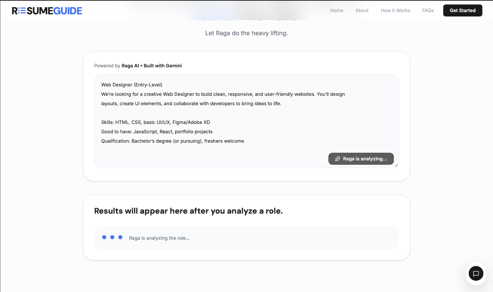
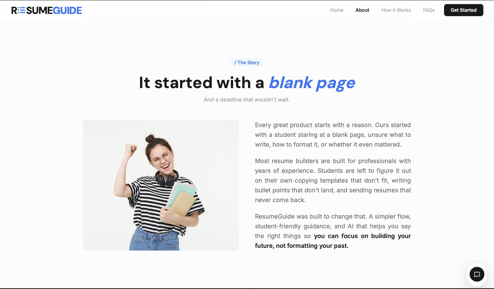
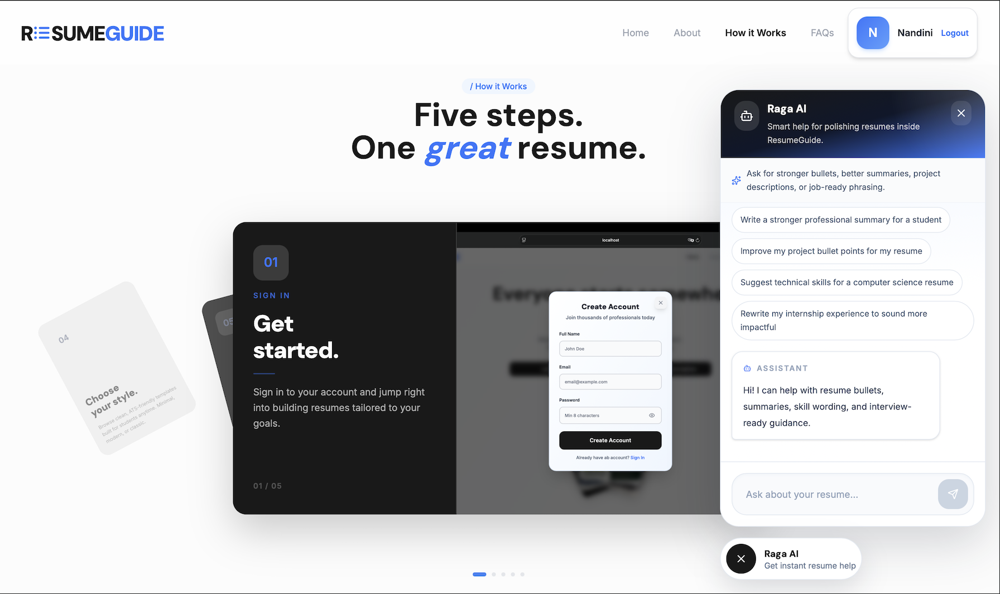

# 📑 ResumeGuide — A Student-Centric Resume Builder  

## Overview  

ResumeGuide is a web-based application designed to assist students in understanding and creating well-structured resumes. Unlike conventional resume builders that focus on automated content generation, this system emphasizes guided learning, enabling users to develop their own resume content with clarity and intent.  

The application is built with a student-first approach, ensuring that users not only create a resume but also gain a clear understanding of its structure, purpose, and relevance.  

---

## Problem Statement  

Students often face difficulty in building effective resumes due to a lack of guidance and understanding of industry expectations. Most existing tools are tailored for experienced professionals and assume prior knowledge, which results in:  

- Unstructured or unclear resumes  
- Over-reliance on copied or generic content  
- Low confidence in presenting personal skills and experiences  

---

## Proposed Solution  

ResumeGuide addresses these challenges through a structured and guided system that supports users throughout the resume creation process.  

Key aspects of the solution include:  

- Step-by-step resume construction workflow  
- Contextual guidance to assist content writing  
- Student-oriented section design  
- Interactive and intuitive user interface  
- Focus on self-written, meaningful input rather than automated generation  

The system is designed to promote both understanding and independence in resume creation.  

---

## Key Features  

- Real-time, side-by-side live preview of the resume during editing  
- Ability to switch between templates without losing entered content  
- Resume download in PDF format  
- Clean and minimal interface focused on usability and clarity  
- Integrated AI chatbot (Raga AI) to assist users with content, guidance, and resume-related queries in real time  

---

## Job Description Analysis  

ResumeGuide includes an integrated AI-powered feature (Raga AI using Gemini) that enhances resume quality by aligning it with real-world job requirements.  

Users can paste a job description from any company, and the system provides:  

- Identification of important keywords to include in the resume  
- Suggestions on what content to prioritize or highlight  
- Relevant skills and tools expected for the role  
- General ATS (Applicant Tracking System) optimization tips  

This feature helps students tailor their resumes strategically, improving relevance and increasing the chances of passing initial screening processes.  

---

## Objectives  

- To encourage students to write resume content independently  
- To improve understanding of resume structure and purpose  
- To reduce dependency on copy-paste practices  
- To enhance the overall quality of student resumes  
- To provide a clear and confidence-building user experience  

---

## Scope  

- Web-based resume creation platform  
- Focus on students and entry-level users  
- Emphasis on usability, clarity, and guided interaction  
- Supports resume creation and export functionality  

---

## Technology Stack  

Frontend  
- React.js  
- Tailwind CSS  
- HTML  

Backend  
- Node.js  
- Express.js  

Database  
- MongoDB  

Additional Tools  
- Gemini API (for AI-powered features)  
- Image assets sourced from various online platforms  

---

## System Approach  

The application follows a learning-driven approach, where the user is guided through each section of the resume with relevant prompts and structure. Instead of providing ready-made content, the system encourages users to think critically and articulate their own experiences.  

This approach ensures that the final output is both authentic and professionally aligned.  

---

## Preview

### Home Interface

  

### Job Description Analysis (Raga AI)

  

### ResumeGuide Story

  

### AI Chatbot Assistance

  

---

## Author  

Nandini Dipak Tekwade  

---

## License  

This project is intended for academic and educational purposes.
